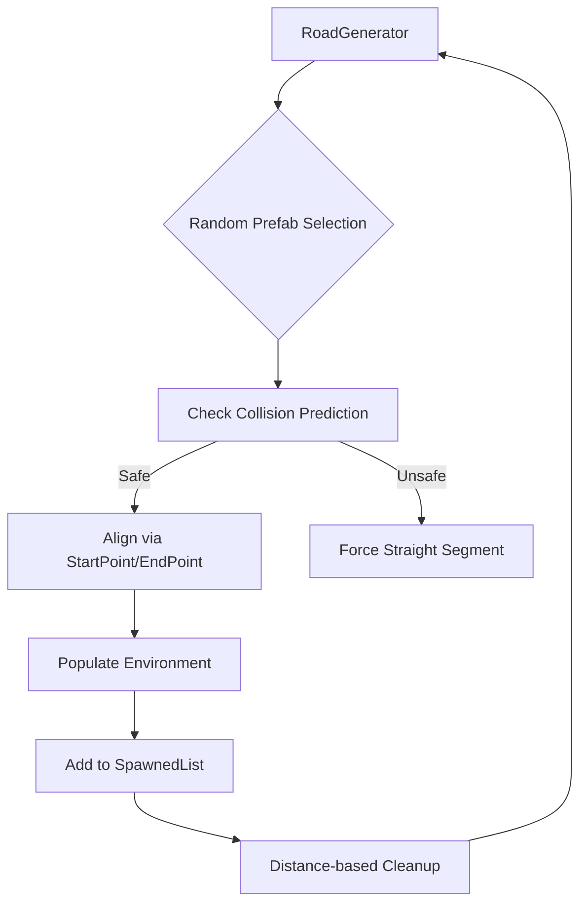

# White Noise Road — Система процедурной генерации бесконечного пути в Unity 6

## 📝 Описание проекта

**Infinite Road Generator** — это технический прототип игры от первого лица, реализующий алгоритм бесконечной процедурной генерации дорожного полотна. Основная цель проекта — создание бесшовного игрового мира с динамическим окружением, который генерируется «на лету» и оптимизируется в реальном времени для обеспечения высокой производительности.

Проект фокусируется на решении геометрических задач стыковки сложных префабов, предотвращении самопересечения дороги и оптимизации рендеринга большого количества объектов окружения.

## 📸 Скриншоты / Видео
*(Здесь добавим потом GIF-ку с ездой по дороге и скриншот из редактора с расставленными StartPoint/EndPoint)*

## 📐 Архитектура генерации

Система построена на принципе **цепочечной стыковки через контрольные точки**. В отличие от простой расстановки по сетке, данный метод позволяет использовать сегменты любой формы (повороты 90°, изгибы, перепады высот).

**Ключевые инженерные решения:**
*   **Matrix Alignment System:** Стыковка сегментов происходит через пересчет локальных смещений. Новый сегмент временно позиционируется в `EndPoint` предыдущего, после чего вычисляется вектор смещения `StartPoint` и компенсируется, что гарантирует идеальный стык без щелей.
*   **Collision Prediction (Защита от наложений):** Для предотвращения ситуации, когда дорога «наезжает» сама на себя, реализован алгоритм математического прогнозирования. Перед спавном сегмента система вычисляет его будущий центр и проверяет дистанцию до всех активных сегментов в памяти.
*   **Local-Space Environment Populating:** Окружение (деревья, камни) генерируется в локальных координатах каждого сегмента. Это позволяет объектам автоматически следовать за поворотами дороги и удаляться вместе с ней.
*   **Memory Management:** Реализовано «скользящее окно» рендеринга. Сегменты, удалившиеся за пределы дистанции `destroyDistance`, уничтожаются, что предотвращает утечку памяти и деградацию FPS.

## 📂 Структура проекта

*   **`Scripts/Core/`** — Ядро генерации. Логика выбора префабов, математика стыковки и контроль дистанции.
*   **`Scripts/Player/`** — Физический контроллер автомобиля (на базе `linearVelocity` Unity 6) и система сглаженного управления камерой (Slerp).
*   **`Prefabs/Road/`** — Набор сегментов дороги с настроенными точками входа и выхода.
*   **`Prefabs/Environment/`** — Библиотека объектов окружения с настроенным GPU Instancing.
*   **`Materials/`** — URP-материалы, оптимизированные для рендеринга больших массивов объектов.

## 🌟 Основные возможности

### 🛣 Процедурный мир
*   **Бесшовность:** Полное отсутствие визуальных разрывов между сегментами.
*   **Динамический ландшафт:** Настраиваемые вероятности появления прямых участков и поворотов для предотвращения «зигзагов».
*   **Интеллектуальный спавн:** Система автоматически подбирает безопасный сегмент, если выбранный поворот ведет к пересечению с существующей дорогой.

### 🏎 Физика и Управление
*   **Unity 6 Physics:** Использование современного API `linearVelocity` для плавного разгона и торможения.
*   **Adaptive Steering:** Инверсия рулевого управления при движении задним ходом для реализма.
*   **Smooth Camera:** Система FPS-камеры с блокировкой курсора и интерполяцией вращения.

### 🌲 Оптимизация окружения
*   **GPU Instancing:** Снижение количества Draw Calls за счет отрисовки идентичных объектов природы одним проходом.
*   **Automatic Cleanup:** Иерархическая привязка объектов окружения к сегментам дороги для мгновенной очистки памяти.

## 🚀 Roadmap (Планы развития)

*   [x] **Core Generation:** Базовая стыковка StartPoint/EndPoint.
*   [x] **Collision Protection:** Система предсказания наложений дороги.
*   [x] **Environment System:** Рандомное заполнение обочин объектами.
*   [x] **Unity 6 Integration:** Переход на актуальный физический движок.
*   [ ] **Biome System:** Смена типов окружения (Лес $\rightarrow$ Горы $\rightarrow$ Пустыня).
*   [ ] **Weather Module:** Динамический дождь, туман и изменение материалов дороги (мокрый асфальт).
*   [ ] **Floating Origin:** Смещение мира для предотвращения ошибок точности при сверхдлинных заездах.
*   [ ] **Object Pooling:** Замена `Instantiate/Destroy` на пул объектов для устранения микро-фризов.

## 🛠 Технологический стек

*   **Engine:** Unity 6 (Universal Render Pipeline).
*   **Language:** C#.
*   **Input:** New Input System Package.
*   **Physics:** PhysX (Unity 6 `linearVelocity` API).
*   **Rendering:** PBR Materials, GPU Instancing.

## ⚙️ Запуск проекта

1. Склонируйте репозиторий.
2. Откройте проект в **Unity Hub** (версия 6.0+).
3. Убедитесь, что установлен пакет **Input System**.
4. Запустите сцену `MainScene`.

## 📄 Лицензия

Распространяется под лицензией [MIT](https://opensource.org/licenses/MIT).

## 👤 Автор

**Твое Имя** ([@твой_ник](https://github.com/твой_ник))

*Проект разработан с использованием архитектурных рекомендаций больших языковых моделей ИИ.*
