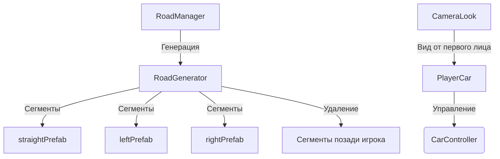

# WhiteNoiseRoad — Игра с бесконечной процедурной генерацией дороги

[](https://unity.com/)
[](https://microsoft.com/en-us/visualstudio/languages/csharp)
[](LICENSE)
[]()

## 📝 Описание проекта

**RoadRacer** — это игра с бесконечной процедурной генерацией дороги в режиме реального времени. Проект демонстрирует современные техники генерации контента, физики и реализма для игр с открытым миром.

Основные особенности:
* Бесконечная генерация дороги с поворотами, прямых участков и разнообразными сегментами
* Реалистичная физика управления автомобилем
* Система топлива и расхода
* Динамическая камера от первого лица с возможностью обзора салона
* Генерация окружения по бокам дороги
* Защита от наезда дороги самой на себя

## 📸 Скриншоты интерфейса

### Игровой процесс с видом от первого лица:

### Система генерации дороги:

### Настройки генерации:

### Камера внутри салона:


## 📐 Архитектура системы

Игра использует модульную архитектуру с разделением на основные компоненты:

**Ключевые инженерные решения:**
* **Модульная генерация:** Система префабов с точками стыковки `StartPoint` и `EndPoint` обеспечивает идеальное соединение сегментов дороги.
* **Защита от пересечений:** Алгоритм проверки на безопасность позиции предотвращает наезд дороги самой на себя.
* **Гибкая система вероятностей:** Возможность настройки вероятностей появления различных типов сегментов (прямые, повороты).
* **Оптимизация памяти:** Система удаления старых сегментов на основе дистанции от игрока.



## 📂 Структура репозитория

* **`Assets/Scripts/`** — Все скрипты игры:
  * `CarController.cs` — Управление автомобилем с физикой
  * `RoadGenerator.cs` — Генерация бесконечной дороги
  * `CameraLook.cs` — Камера от первого лица
  * `EnvironmentSpawner.cs` — Генерация окружения
* **`Assets/Prefabs/`** — Префабы дороги и окружения:
  * `RoadStraight.prefab` — Прямой участок дороги
  * `RoadLeft.prefab` — Поворот влево
  * `RoadRight.prefab` — Поворот вправо
  * `EnvironmentObjects/` — Префабы деревьев, зданий и других объектов
* **`Assets/Scenes/`** — Сцены игры:
  * `SampleScene.unity` — Основная сцена с дорогой и машиной

## 🌟 Основные возможности

### 🚗 Управление и физика

* **Реалистичная физика:** Использование `linearVelocity` (новая фича Unity 6) для плавного управления
* **Управление поворотами:** Повороты учитывают текущее направление движения (повороты влево/вправо в зависимости от движения вперед/назад)
* **Плавное ускорение и торможение:** Реалистичные алгоритмы разгона и торможения

### 🛣️ Генерация дороги

* **Модульная система:** Сегменты дороги соединяются через точки стыковки `StartPoint` и `EndPoint`
* **Защита от пересечений:** Алгоритм проверки на безопасность позиции
* **Вероятностная генерация:** Настройка вероятностей появления различных типов сегментов
* **Ограничение на количество поворотов подряд:** Предотвращает создание маленьких кругов

### 📷 Камера и визуализация

* **Камера от первого лица:** С возможностью плавного обзора салона
* **Сглаживание камеры:** Использование `Slerp` для плавных движений
* **Блокировка курсора:** Автоматическая блокировка при запуске игры
* **Центрирование камеры:** Кнопка R для сброса камеры в исходное положение

### 🌳 Окружение

* **Генерация объектов по бокам дороги:** Деревья, здания, фонари
* **Удаление старых объектов:** Система удаления по дистанции от игрока
* **Разнообразие:** Вариативность объектов для предотвращения монотонности

## 🚀 Roadmap (Планы развития)

* [x] **Базовая генерация дороги:** Реализация системы сегментов и стыковки
* [x] **Защита от пересечений:** Алгоритм проверки на безопасность позиции
* [x] **Реалистичная физика:** Использование `linearVelocity` и плавного управления
* [x] **Камера от первого лица:** Система обзора салона
* [x] **Генерация окружения:** Система спавна объектов по бокам дороги
* [ ] **Система топлива:** Топливный бак, расход и необходимость заправки
* [ ] **Система соревнований:** Время прохождения трассы, рекорды
* [ ] **Система повреждений:** Повреждение автомобиля при столкновениях
* [ ] **Динамические погодные условия:** Дождь, туман, снег
* [ ] **Система смены времени суток:** День/ночь, динамическое освещение

## 🛠 Технологический стек

* **Game Engine:** Unity 6 (2023.3.0f1)
* **Scripting:** C# 12, Unity Input System
* **Physics:** Rigidbody, linearVelocity
* **Procedural Generation:** Алгоритмы генерации с защитой от пересечений

## ⚙️ Требования к окружению и Запуск

### 1. Требования

* Unity 6 (2023.3.0f1) или выше
* .NET Framework 4.8 или выше

### 2. Установка и запуск

1. Склонируйте репозиторий:
   ```bash
   git clone https://github.com/iamfifya/RoadRacer.git
   ```

2. Откройте проект в Unity Editor:
   * Запустите Unity Editor
   * Выберите "Open Project" → "Open from disk" → выберите папку проекта

3. Запустите игру:
   * В иерархии (Hierarchy) найдите объект `SampleScene`
   * Нажмите кнопку Play (треугольник вверху)

### 3. Управление

* **W/S** — Газ/тормоз
* **A/D** — Повороты
* **Мышь** — Поворот камеры внутри салона
* **R** — Сброс камеры в исходное положение
* **Esc** — Разблокировка курсора

## 📄 Лицензия

Распространяется под лицензией [MIT](https://opensource.org/licenses/MIT).

## 👤 Автор

**Dima Kuraedov** ([@iamfifya](https://github.com/iamfifya))

* Telegram: [@iamfifya](https://t.me/iamfifya)
* Email: dimakuraedov@gmail.com

*Игра спроектирована и разработана с использованием современных техник генерации контента и физики для создания реалистичного игрового опыта.*
*Проект разработан с использованием архитектурных рекомендаций больших языковых моделей ИИ.*
